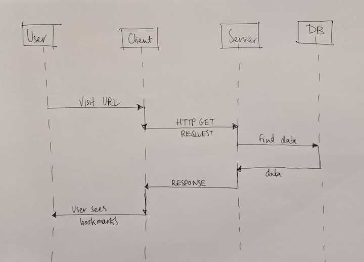

# Bookmark Manager #

A web app which allows a user to bookmark their favourite sites.

## Useage instructions ##

1. Connect to psql
2. Create the database using the psql command CREATE DATABASE bookmark_manager;
3. Connect to the database using the pqsl command \c bookmark_manager;
4. Open file /db/migrations/01_create_bookmarks_table.sql and run the command in the file in your terminal

*Add instructions about setting up test environment*

## User stories ##
```
As a user
So that I can revisit sites I like
I would like to see a list of bookmarks
```

## Domain Model Diagram ##

